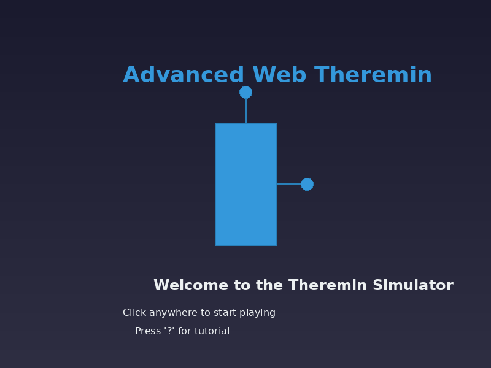

# Advanced Web Theremin


A feature-complete theremin simulation that provides an engaging and authentic experience for users. This web application uses the Web Audio API to create a realistic theremin-like instrument that can be played using mouse or touch input.

## What is a Theremin?

A theremin is an electronic musical instrument controlled without physical contact. It was invented by Russian physicist Léon Theremin in 1920. The instrument produces sound through electromagnetic fields, with two antennas that sense the position of the player's hands:
- A vertical antenna controls pitch
- A horizontal antenna controls volume

The theremin has a distinctive sound often described as a cross between a violin and a soprano voice, with an ethereal, eerie quality. It's been used in movie soundtracks, classical performances, and popular music.

## Demo


## Screenshots

### Welcome Screen


### Main Interface


## Features

### Core Functionality
- Realistic theremin sound simulation
- Responsive design that works on both desktop and mobile devices
- Intuitive interface with vertical position controlling pitch and horizontal position controlling volume
- Frequency range from 65 Hz to 3000 Hz, matching real theremin characteristics

### Advanced Sound Options
- Multiple waveform options (sine, square, sawtooth, triangle)
- Reverb effect with adjustable amount
- Tremolo effect with adjustable speed and depth
- Distortion effect with adjustable amount
- Audio visualizer showing waveform and frequency spectrum (toggle by clicking)

### User Experience
- Welcome screen with introduction to the theremin
- Interactive tutorial explaining how to play
- Keyboard shortcuts for common actions
- Accessible UI elements with proper ARIA attributes
- High contrast mode support
- Reduced motion support

### Preset System
- Save your favorite theremin settings
- Load presets with a single click
- Default preset included

### Recording Functionality
- Record your theremin performances
- Play back recordings directly in the browser
- Download recordings as audio files

## Installation

### Option 1: Direct Download
1. Download or clone this repository
2. Open `index.html` in a modern web browser
3. Start playing the theremin!

### Option 2: Using a Local Server
For the best experience, especially with audio recording features, we recommend using a local server:

1. Download or clone this repository
2. If you have Python installed:
   ```
   # Python 3
   python -m http.server
   
   # Python 2
   python -m SimpleHTTPServer
   ```
3. Or use the included test script:
   ```
   python test_theremin.py
   ```
4. Open your browser and navigate to `http://localhost:8000`

### Production Use
For production use, you can use the minified versions of the JavaScript and CSS files:

1. In `index.html`, comment out the development versions and uncomment the production versions:
   ```html
   <!-- <script src="theremin.js"></script> -->
   <script src="dist/theremin.min.js"></script>
   <!-- <link rel="stylesheet" href="styles.css"> -->
   <link rel="stylesheet" href="dist/styles.min.css">
   ```

## How to Use

### Playing the Theremin
1. Click or touch the theremin area to start producing sound
2. Move your cursor/finger up and down to change the pitch (higher position = higher pitch)
3. Move your cursor/finger left and right to change the volume (right = louder)
4. Release to stop the sound

### Sound Customization
- Select different waveforms to change the basic sound character
- Toggle effects on/off and adjust their parameters
- Adjust volume sensitivity to control how responsive the theremin is to horizontal movement

### Using Presets
1. Select a preset from the dropdown menu to load saved settings
2. Click "Save Preset" to save your current settings
3. Enter a name for your preset when prompted

### Recording
1. Click "Record Performance" to start recording
2. Play the theremin
3. Click "Stop Recording" to finish
4. Use the play button to listen to your recording
5. Click "Download Recording" to save the audio file

### Keyboard Shortcuts
- **Space**: Toggle tutorial
- **Ctrl+R**: Start/stop recording
- **Ctrl+S**: Save current preset
- **1-4**: Select waveform (sine, square, sawtooth, triangle)

## Technical Implementation

The theremin simulation is built using modern web technologies:

### Web Audio API
The core of the theremin is implemented using the Web Audio API, which provides a powerful system for audio processing in the browser:

- **AudioContext**: The foundation for all audio operations
- **OscillatorNode**: Generates the base sound waves
- **GainNode**: Controls volume and sound dynamics
- **ConvolverNode**: Creates reverb effects
- **WaveShaperNode**: Implements distortion
- **AnalyserNode**: Provides data for audio visualization

### Sound Generation
The theremin sound is generated by:

1. Creating an oscillator with a selectable waveform
2. Mapping vertical hand/cursor position to frequency (65 Hz to 3000 Hz)
3. Mapping horizontal hand/cursor position to volume
4. Applying audio effects based on user settings

### Audio Effects
- **Reverb**: Implemented using a convolver node with an impulse response
- **Tremolo**: Created with a low-frequency oscillator (LFO) modulating the gain
- **Distortion**: Implemented with a waveshaper node using a custom curve

### Data Storage
- User presets are saved using the browser's localStorage API
- Audio recordings use the MediaRecorder API and are stored as Blob objects

### Performance Optimization
- Audio nodes are connected only when needed
- Resources are properly cleaned up when not in use
- Visualizations use efficient rendering techniques
- Mobile-specific optimizations for touch interfaces

## Browser Compatibility

The theremin simulator works best in modern browsers with good Web Audio API support:

- Chrome 70+
- Firefox 75+
- Safari 14.1+
- Edge 79+

Mobile browsers are supported, but performance may vary depending on the device.

## File Structure

```
theremin/
├── index.html              # Main HTML file
├── styles.css              # CSS styles
├── theremin.js             # Main JavaScript implementation
├── assets/                 # Images and other assets
│   ├── favicon.ico         # Favicon
│   ├── theremin_logo.png   # Theremin logo
│   └── theremin_demo.gif   # Demo animation
├── dist/                   # Production files
│   ├── theremin.min.js     # Minified JavaScript
│   └── styles.min.css      # Minified CSS
└── README.md               # This documentation
```

## Credits and Research

This theremin simulation is based on research into both the physical theremin instrument and Web Audio API implementation techniques:

### Theremin Characteristics
- The frequency range (65 Hz to 3000 Hz) is based on the typical range of a real theremin
- The sound generation approach mimics the distinctive theremin timbre
- The interface design is inspired by the physical interaction model of a real theremin

### Web Audio Resources
- Mozilla Developer Network (MDN) Web Audio API documentation
- Web Audio API examples and libraries from GitHub
- Research on audio effect implementation techniques

## License

This project is open source and available under the MIT License.